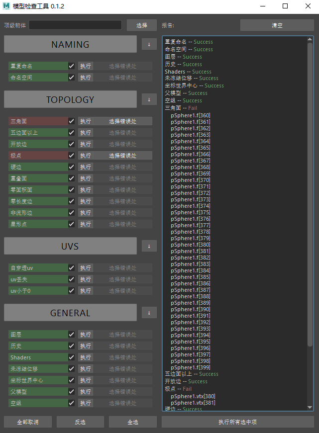

<h1 align="center">modelChecker</h1>

modelChecker is a python plug-in written for Autodesk Maya to sanity check digital polygon models. It is unopinionated, provides concise reporting, and lets you select your error nodes easily.



## Setup

Download the [modelChecker.zip](https://github.com/ypypjay/modelChecker/archive/main.zip) and move the modelChecker folder in your Maya scripts directory and create a python shell button with the following code:

```python
from modelChecker import modelChecker_UI

modelChecker_UI.UI.show_UI()
```

## Usage

There are three ways to run the checks.

1. If you have objects selected the checks will run on the current selection.
2. A hierachy by declaring a top node in the UI.
3. If you have an empty selection and no top node is declared the checks will run on the entire scene.

## Authors

- [**Jakob Kousholt**](https://www.linkedin.com/in/jakobjk/) - Software Engineer / Freelance Creature Modeler
- [**Niels Peter Kaagaard**](https://www.linkedin.com/in/niels-peter-kaagaard-146b8a13) - Senior Modeler at Weta Digital
- [**岳鹏**](https://www.linkedin.com/in/%E5%B2%B3-%E9%B9%8F-8b31138b/) - Technical Artist

## Support & Feedback

For any bugs, errors, and requests feel free to reach out to [秋山](mailto:ypypjay@gmail.com)

If you want to support original author, feel free to "buy" the modelChecker from [Gumroad](https://jakejk.gumroad.com/l/htZYj).

## License

modelChecker is licensed under the [MIT](https://rem.mit-license.org/) License.
